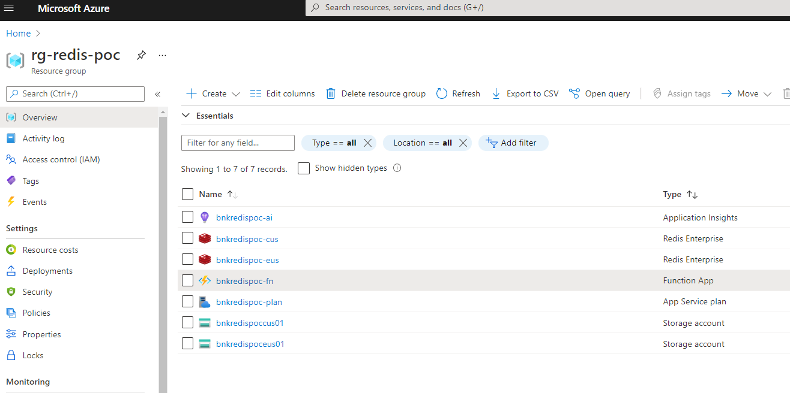
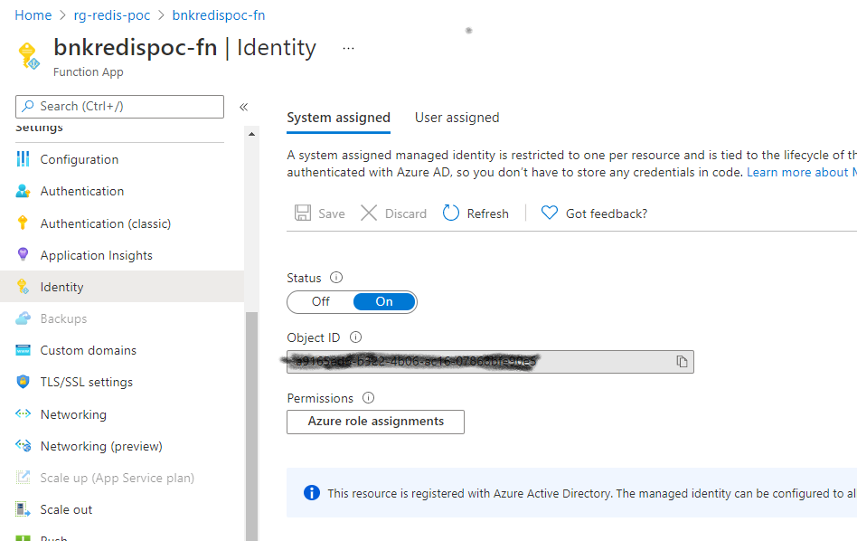
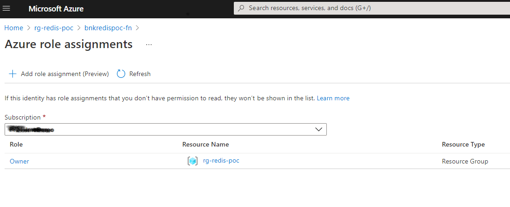

# Redis-Sync-POC

This project demonstrates a way to sync a Redis Enterprise Cache between 2 locations. The code included is meant to illustrate
the process for demo purposes, but the concepts could be extended to a production use case.

## Technologies

- **Bicep** : A tool used to create infrastructure templates for standarized deployments
- **Azure Functions** : A serverless runtime environment for on-demand code, supporting multiple languages and environment
- **PowerShell Fn** : We chose PowerShell because there's existing commandlets for exporting and importing from Azure Redis

## Approach

1. Define an infrastructure for our code to run, this includes the following, see **main.bicep** and substitute your *appName* value. For purposes of illustration I used *bnkredispoc*
    - **SRC Cluster** : Source Cluster
    - **DR Cluster** : Disaster Recovery cluster
    - **SRC Azure Storage** : Storage in the source region
    - **DR Azure Storage** : Storage in DR region
    - **App Svc Hosting Plan** : Hosting plan for function
    - **Function App** : Container for the functions to do the sync
    - **App Insights** : Monitoring of the function
    
    

2. Add function App *fnAppRedisSyncPS* to perform extract, copy the data, and import the data
    - **fnHttpRedisExportPS** : Exports the cache when triggered by HTTP call
    - **fnBlobCopySrcToDest** : Uses blob trigger and bindings to copy blob from source to dest
    - **fnBlobRedisImport** : Imports the blob into the cache when it arrives
3. Deploy Infrastructure from **./deploy** folder
    - `az deployment group create --name [name] --resource-group [rg-redis-poc] --template-file main.bicep`
1. Deploy Code from **./fnAppRedisSyncPS** folder
    - `func azure functionapp publish [bnkredispoc-fn]`
1. In the Azure portal enable **system managed identity** by going to the app settings and turning on the setting. Also add an RBAC role assignment to the service to grant access at the Resource Group scope.

then click on *Azure Role Assignments* and add role

## References
- [DOCS: Import-AzRedisEnterpriseCache](https://docs.microsoft.com/en-us/powershell/module/az.redisenterprisecache/import-azredisenterprisecache?view=azps-6.0.0)
- [DOCS: New-AzStorageContainerSASToken](https://docs.microsoft.com/en-us/powershell/module/az.storage/new-azstoragecontainersastoken?view=azps-6.0.0)
- [DOCS: Azure Blob storage trigger for Azure Functions](https://docs.microsoft.com/en-us/azure/azure-functions/functions-bindings-storage-blob-trigger?tabs=csharp)
- [DOCS: Quickstart - Create Az Fn from ARM](https://docs.microsoft.com/en-us/azure/azure-functions/functions-create-first-function-resource-manager?tabs=visual-studio-code%2Cazure-cli)
- [SO: Https Call from Az Fn](https://stackoverflow.com/questions/52546638/how-to-make-https-call-from-azure-function)
- [DOCS: Managed Service Identities for Fn](https://docs.microsoft.com/en-us/azure/app-service/overview-managed-identity?tabs=dotnet)